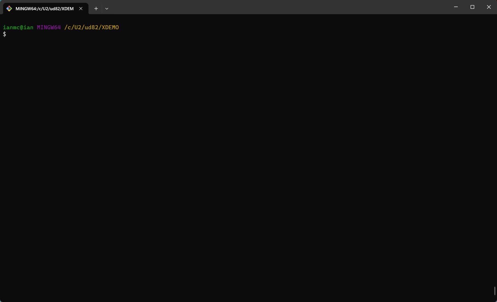

# SIMBIAN.BP
Public MV Utilities

## STACK

A TCL wrapper that aims to provide a bash-like command line interface for MV databases.
Use cursor keys for editing, no more .A, .R or .C to recall previous commands!

In recent versions there is also word-based tab completion.  STACK indexes every word typed, and hitting tab on a partial word
will complete from the available partial matches.  Useful for those long program, file or dictionary names.



## JSON.GET.QUERY / JSON.GET.TEST

The query program is used to simulate the very basics of <a href="https://jqlang.org/">jq</a>, but the only operations
currently supported are extracting a named attribute from an object or a specific array element.

E.g. given this JSON:
```json
{
    "name": "Belgium",
    "capital": "Brussels",
    "population": 11513931,
    "primeMinister": { "name": "Bart De Wever", "date": "2025-02-03" }
    "languages": ["Dutch", "French", "German"],
    "regions": [ {"name": "Flanders", "pop": 6629000}, {"name": "Wallonia", "pop": 3645000}, {"name": "Brussels", "pop": 1208000} ]
}
```

You can call the query subroutine and get results like this:

|Query              |Result       |
|-------------------|-------------|
|.name              |Belgium      |
|.primeMinister.name|Bart De Wever|
|.languages.[2]     |French       |
|.regions.[3].name  |Brussels     |

Note, array indexes are 1-based like PICK Basic, not 0-based like jq!  It's more efficient to call GET.OBJECT/GET.ARRAY compared
to multiple invocations of GET.QUERY - the latter uses those lower-level utilities to get the data into structures familiar to
a PICK Basic programmer.

```
SUBROUTINE JSON.GET.QUERY(JSON.STRING, QUERY, RESULT, ERR)
  * Query a JSON object to return a value
  *   Input : JSON.STRING - A JSON object or array starting with '{' or '['
  *   Query : QUERY - A string that lists the query similar to a (very) basic JQ query
  *   Output: RESULT - either a complex object/array or simple string, number, literal
  * Examples (see JSON.GET.TEST for more):
  *   JSON.STRING = ' {"name":"John Doe","age":30,"address":{"street":"123 Main St","city":"Anytown"},'
  *   JSON.STRING:= ' "phones":["555-1234","555-5678",{"Phone": "555-1212", "Ext": 1234}] }'
  *   QUERY='.name'          ; RESULT=John Doe
  *   QUERY='.address'       ; RESULT={"street":"123 Main St","city":"Anytown"}
  *   QUERY='.address.city'  ; RESULT=Anytown
  *   QUERY='.phones.[3].Ext'; RESULT=1234
```

The test program is an exercise in TDD, and makes sure that the parsing is done correctly. This has been super-helpful, and trying
to work out how to incorporate something like this into future development.

## JSON.GET.OBJECT / JSON.GET.ARRAY

Two lower-level utilities for parsing JSON.  Since Unidata doesn't have hierarchical data structures, the programs put
off parsing anything except for one-level, and it's up to the programmer to recurse through the data structures.

E.g. given this JSON:

```json
{
    "name": "Belgium",
    "capital": "Brussels",
    "population": 11513931,
    "primeMinister": { "name": "Bart De Wever", "date": "2025-02-03" }
    "languages": ["Dutch", "French", "German"],
    "regions": [ {"name": "Flanders", "pop": 6629000}, {"name": "Wallonia", "pop": 3645000}, {"name": "Brussels", "pop": 1208000} ]
}
```
```
CALL JSON.GET.OBJECT(JSON, RESULT, ERR) will return

ERR=""
RESULT<1>=name | capital | population | primeMinister | languages | regions
RESULT<2>=STRING | STRING | NUMBER | OBJECT | ARRAY | ARRAY
RESULT<3>=Belgium | Brussels | 11513931 | { "name": "Bart De Wever", "date": "2025-02-03" } | ["Dutch", "French", "German"] | [ {"name": "Flanders", "pop": 6629000}, {"name": "Wallonia", "pop": 3645000}, {"name": "Brussels", "pop": 1208000} ]
```
And you can then extract the PM, languages and regions like so:

Prime Minister:
```
PM.JSON=RESULT<3,4>
CALL JSON.GET.OBJECT(PM.JSON, PM.REC, ERR)

PM.REC<1>=name | date
PM.REC<2>=STRING | STRING
PM.REC<3>=Bart De Wever | 2025-02-03
```
Languages:
```
LANG.JSON=RESULT<3,5>
CALL JSON.GET.ARRAY(LANG.JSON, LANGS, ERR) will return

LANGS<1>=Dutch
LANGS<2>=French
LANGS<3>=German
```
Regions: 
```
CALL JSON.GET.ARRAY(REGION.JSON, REGIONS, ERR) will return

REGIONS<1>={"name": "Flanders", "pop": 6629000}
REGIONS<2>={"name": "Wallonia", "pop": 3645000}
REGIONS<3>={"name": "Brussels", "pop": 1208000} 
```
Which you can of course parse with JSON.GET.OBJECT to get the name and pop in a structured way.
